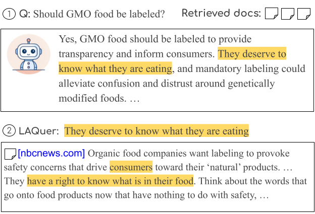
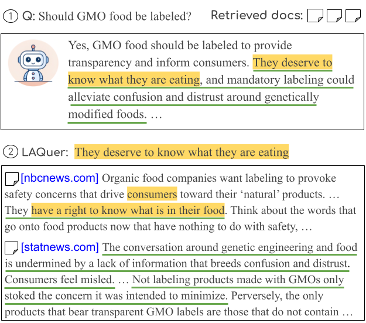
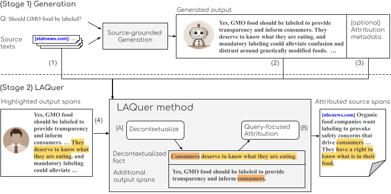

# LAQuer: Localized Attribution Queries in Content-grounded Generation

Repository for the publication "LAQuer: Localized Attribution Queries in Content-grounded Generation" (ACL 2025).

[[📄 Paper](https://aclanthology.org/2025.acl-long.746/)]


### What is LAQuer?
LAQuer enables users to request attribution for specific spans of LLM-generated text by highlighting the exact information they care about. This produces localized, span-level attributions rather than broad sentence-level citations.



### Why localized attribution?
- Users often need provenance for a small piece of information, not an entire sentence.
- Localized attribution reduces reading effort and makes verification faster and more precise.
- Example: a long sentence may have multiple facts; highlighting a single fact should return only the relevant sources.



### Evaluation framework
We propose a two-stage framework that leverages existing sentence-level attributions and extends them to localized (highlight-level) attributions:
1. Stage 1 — Coarse attribution: obtain sentence-level or document-level attribution from existing methods.
2. Stage 2 — Localized attribution: refine coarse attributions to the highlighted spans (LAQuer).



# Code: running the LAQuer evaluation
Core steps:
1. Synthesize user highlights from model outputs (supports evaluation on new generation methods).
2. Generate attribution for the highlighted spans.
3. Evaluate the produced attributions against references.

Quick start:
- Ensure you have model outputs in a JSON file named `results.json` (examples are included in the `results/` directory).
- Run the evaluation script:
```
python3 scripts/run_all.py
```
The script will run facts synthesis, attribution generation, and evaluation pipelines.

# Citation

```
@inproceedings{hirsch-etal-2025-laquer,
  title = "LAQuer: Localized Attribution Queries in Content-grounded Generation",
  author = "Hirsch, Eran  and
    Slobodkin, Aviv  and
    Wan, David  and
    Stengel-Eskin, Elias  and
    Bansal, Mohit  and
    Dagan, Ido",
  booktitle = "Proceedings of the 63rd Annual Meeting of the Association for Computational Linguistics (Volume 1: Long Papers)",
  month = jul,
  year = "2025",
  address = "Vienna, Austria",
  publisher = "Association for Computational Linguistics"
}
```
